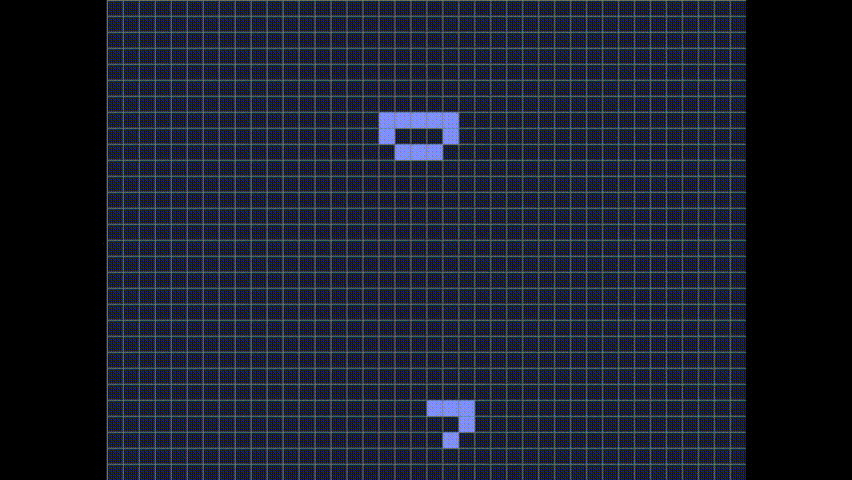

# Game of Life

Simple Conway's game of life coded in C with SDL2



## Install and launch

in the repository, launch in the console
```
make
```
it will create an executable, that you can launch :
```
./game_of_life
```

## How to Play

<kbd> <br> Mouse click <br> </kbd> : make a cell alive or dead, long click while moving to affect more cells <br>
<kbd> <br> Space <br> </kbd> : play/pause the simulation <br>
<kbd> <br> ⬆ <br> </kbd> : Increase the time between each frame <br>
<kbd> <br> ⬇ <br> </kbd> : Decrease the time between each frame <br>

## Road map

✅ (25/11/2024) : Display grid <br>
✅ (26/11/2024) : Alive/Dead cells <br>
✅ (27/11/2024) : Play & Pause features <br>
✅ (27/11/2024) : Change frame rate <br>

⬜ Reset map button <br>
⬜ Add menu bar <br>
⬜ Display frame rate <br>
⬜ Copy/paste features <br>
⬜ Infinite map (chunk) <br>
⬜ Pattern generator <br>

